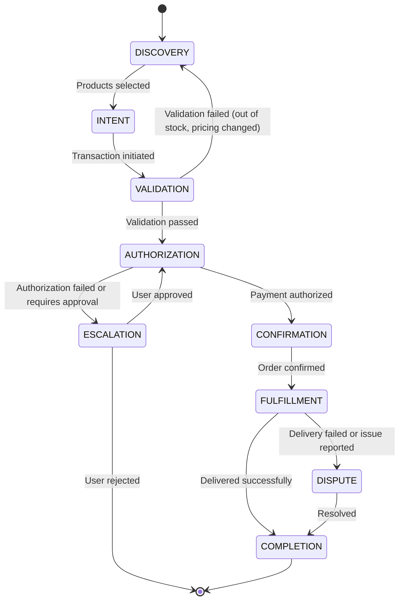

# Chapter 6: Agentic Enablement

> **TL;DR**
>
> - **Agent-ready data**: AI agents require structured, semantic, and transactionally complete product data with consistent identifiers and machine-readable formats
> - **Protocol integration**: Adopt Agent Communication Protocol (ACP) for agent-to-agent commerce and Model Context Protocol (MCP) for context sharing
> - **Transactional workflows**: Design multi-step transaction flows with explicit state management, error handling, and human escalation triggers
> - **Trust architecture**: Build verification layers, audit trails, and approval gates to establish confidence in autonomous purchasing decisions

---

The shift from human-driven e-commerce to agentic commerce represents the most significant transformation in online retail since the emergence of mobile shopping. AI agents purchasing on behalf of users introduce new technical requirements, integration patterns, and governance considerations that go far beyond traditional API commerce.

This chapter provides a technology-agnostic framework for enabling agentic transactions. Whether building for personal AI assistants, enterprise procurement agents, or specialized shopping agents, the principles remain consistent: data must be agent-ready, protocols must be agent-native, workflows must handle autonomous decision-making, and systems must establish trust through transparency and verification.

## 6.1 Agent-Ready Data Patterns

### What Makes Data "Agent-Ready"

Agent-ready data differs fundamentally from human-optimized data. While human interfaces rely on visual presentation, contextual inference, and conversational nuance, AI agents require explicit structure, semantic clarity, and programmatic completeness.

**Core Characteristics of Agent-Ready Data:**

1. **Semantic Completeness**: All attributes explicitly stated, not implied through design or context
2. **Structural Consistency**: Predictable schemas with mandatory fields enforced across catalog
3. **Transactional Accuracy**: Real-time pricing, inventory, and availability with clear SLA definitions
4. **Relationship Clarity**: Explicit hierarchies, dependencies, and compatibility rules
5. **Machine-Readable Formats**: Structured data (JSON-LD, schema.org) over unstructured content

An AI agent cannot infer that a product is "currently out of stock" from a grayed-out button or deduce compatibility requirements from a footnote in the description. Every attribute must be explicitly represented in the data layer.

### Product Data Requirements

Agent-ready product data extends beyond traditional e-commerce catalogs to include semantic enrichment, decision-support attributes, and agent-specific metadata.

#### Essential Product Attributes

| Attribute Category | Required Fields | Agent Use Case | Data Format |
|-------------------|-----------------|----------------|-------------|
| **Core Identity** | SKU, UPC/EAN, Brand, Model Number, Product Name | Unique product identification across systems | String, alphanumeric |
| **Classification** | Category hierarchy, Product type, Taxonomic tags | Discovery and comparison within category | Structured hierarchy |
| **Descriptive** | Full description, Key features, Specifications, Dimensions, Weight | Matching against user requirements | Text + structured attributes |
| **Availability** | In-stock status, Quantity available, Restock date, Regional availability | Purchase feasibility determination | Boolean, integer, date, geo |
| **Pricing** | Base price, Sale price, Price validity period, Currency, Tax classification | Cost calculation and budget validation | Decimal, date range, ISO code |
| **Relationships** | Compatible products, Required accessories, Alternative products, Upgrade path | Bundle recommendations, upsell logic | Product ID arrays |
| **Constraints** | Purchase limits, Geographic restrictions, Age restrictions, License requirements | Compliance and eligibility validation | Rules-based constraints |

#### Semantic Enrichment Strategies

Agents benefit from semantic enrichment that makes implicit knowledge explicit:

**Entity Extraction and Tagging**
- Extract named entities (brands, materials, technologies) from descriptions
- Tag with industry-standard ontologies (schema.org Product, GS1 standards)
- Link to knowledge graphs for contextual understanding

**Attribute Normalization**
- Convert natural language attributes to structured values
  - "Available in red, blue, and green" → `colors: ["red", "blue", "green"]`
  - "Dimensions: 10 x 5 x 3 inches" → `dimensions: {length: 10, width: 5, height: 3, unit: "inches"}`
- Use standardized units and formats (ISO, UCUM for units of measure)

**Decision-Support Metadata**
- Add agent-specific attributes not visible to human users
  - `agent_recommendation_score`: Algorithmic rating for matching
  - `decision_factors`: Key differentiators (["price", "sustainability", "brand"])
  - `comparison_group`: Similar products for relative evaluation

**Example: Traditional vs. Agent-Ready Product Data**

Traditional product data (human-optimized):
```json
{
  "name": "EcoFlow Delta Pro Portable Power Station",
  "description": "Expandable capacity from 3.6kWh to 25kWh. Fast charging - 0 to 80% in 2.7 hours!",
  "price": "$3,699.00",
  "availability": "In Stock"
}
```

Agent-ready product data (machine-optimized):
```json
{
  "id": "sku-ecoflow-delta-pro-2024",
  "gtin": "0850032704427",
  "name": "EcoFlow Delta Pro Portable Power Station",
  "brand": {
    "name": "EcoFlow",
    "id": "brand-ecoflow"
  },
  "category": {
    "primary": "Electronics > Power Equipment > Portable Power Stations",
    "taxonomy_id": "electronics-power-portable"
  },
  "specifications": {
    "capacity_base_wh": 3600,
    "capacity_max_wh": 25000,
    "capacity_expandable": true,
    "output_watts_continuous": 3600,
    "output_watts_surge": 7200,
    "charging_time_80pct_hours": 2.7,
    "weight_lbs": 99.5,
    "dimensions_inches": {
      "length": 25,
      "width": 11.2,
      "height": 16.4
    },
    "battery_chemistry": "LiFePO4",
    "output_ports": {
      "ac_outlets": 4,
      "usb_a_ports": 2,
      "usb_c_ports": 2,
      "dc_ports": 2
    }
  },
  "pricing": {
    "base_price_usd": 3699.00,
    "currency": "USD",
    "sale_price_usd": null,
    "valid_from": "2024-01-01T00:00:00Z",
    "valid_through": "2024-12-31T23:59:59Z",
    "tax_inclusive": false
  },
  "availability": {
    "in_stock": true,
    "quantity_available": 47,
    "stock_status": "in_stock",
    "shipping_estimate_days": 2,
    "regional_availability": ["US", "CA"]
  },
  "relationships": {
    "compatible_accessories": ["sku-ecoflow-expansion-battery", "sku-ecoflow-solar-panel-400w"],
    "required_for_full_use": [],
    "alternative_products": ["sku-bluetti-ac200max", "sku-jackery-explorer-2000"]
  },
  "constraints": {
    "minimum_age": null,
    "geographic_restrictions": ["shipping_to_alaska_hawaii_additional"],
    "purchase_limit_quantity": 3
  },
  "agent_metadata": {
    "decision_factors": ["capacity", "charging_speed", "expandability"],
    "recommendation_score": 0.92,
    "sustainability_rating": "B",
    "comparison_group": "high_capacity_portable_power"
  }
}
```

### Inventory and Pricing Data

Agent transactions require real-time accuracy. Stale inventory or pricing data leads to failed transactions, customer dissatisfaction, and agent distrust of the data source.

#### Real-Time Requirements

**Inventory Accuracy Standards:**
- **Update frequency**: Maximum 5-minute lag for in-stock items
- **Threshold alerts**: Notify when inventory drops below agent-accessible threshold
- **Reserve mechanisms**: Allow agents to reserve inventory during transaction (with timeout)
- **Multi-location awareness**: Surface store-level or warehouse-level inventory when relevant

**Pricing Integrity Requirements:**
- **Price locking**: Honor quoted price for duration of checkout session
- **Dynamic pricing transparency**: Explicitly flag when prices update based on demand
- **Tax calculation**: Provide accurate tax based on shipping destination
- **Promotional eligibility**: Machine-readable rules for discount application

#### Data API Patterns

**Synchronous Inventory Check**
```
GET /api/v1/inventory/{sku}?location={zip_code}
Response: {
  "sku": "...",
  "in_stock": true,
  "quantity_available": 12,
  "reserve_duration_minutes": 15,
  "last_updated": "2024-03-15T14:23:01Z"
}
```

**Price Validation Endpoint**
```
POST /api/v1/pricing/validate
Request: {
  "items": [{"sku": "...", "quantity": 2}],
  "shipping_destination": {"zip": "10001"},
  "promo_codes": ["SAVE10"]
}
Response: {
  "subtotal": 1599.98,
  "tax": 139.12,
  "shipping": 0.00,
  "discounts": -160.00,
  "total": 1579.10,
  "valid_until": "2024-03-15T15:00:00Z"
}
```

### Enrichment Strategies

Transform basic product data into agent-optimized decision-support information:

**Comparative Enrichment**
- Generate feature comparison matrices for products in same category
- Calculate value scores (features per dollar, performance per watt)
- Surface most common decision criteria based on historical data

**Contextual Enrichment**
- Add use-case tags: "best for RV camping", "suitable for home backup"
- Include compatibility with common ecosystems (works with Apple HomeKit, etc.)
- Reference third-party ratings, certifications, awards

**Temporal Enrichment**
- Flag newly released products (recency bias for tech categories)
- Surface upcoming replacements/updates (purchase timing optimization)
- Historical pricing trends (deal validation)

**Sentiment Enrichment**
- Aggregate review sentiment scores by attribute
  - "battery_life_sentiment": 0.87 (positive)
  - "portability_sentiment": 0.43 (mixed)
- Extract common complaints and praise themes
- Surface expert vs. consumer opinion divergence

## 6.2 API/Protocol Integration Patterns

### API Design for AI Agents

AI agents require API patterns that differ from traditional REST or GraphQL endpoints built for human-driven applications. Agent-optimized APIs prioritize semantic clarity, error transparency, and stateful transaction support.

#### Agent-Optimized API Design Principles

| Principle | Description | Implementation |
|-----------|-------------|----------------|
| **Explicit Intent** | Each endpoint represents a clear business intent | `/initiate-purchase` not `/cart/add` |
| **State Management** | APIs maintain transaction state across multi-step flows | Transaction IDs with state persistence |
| **Error Semantics** | Rich error responses with machine-readable codes and human-readable explanations | Structured error objects with remediation guidance |
| **Idempotency** | Repeat calls produce same result without side effects | Idempotency keys for all mutating operations |
| **Versioning** | Explicit API versioning with deprecation notices | `/v2/checkout` with sunset dates in headers |
| **Rate Limiting** | Transparent rate limits with retry-after guidance | HTTP 429 with `Retry-After` header |
| **Pagination** | Consistent cursor-based pagination | `next_cursor` tokens, not page numbers |
| **Validation** | Input validation with detailed field-level errors | JSON Schema validation with error paths |

#### Endpoint Pattern Examples

**Discovery Endpoint**
```
POST /api/v2/discover
Request: {
  "query": "portable power station for camping with solar charging",
  "filters": {
    "capacity_wh_min": 1000,
    "budget_max_usd": 2000
  },
  "limit": 10,
  "sort": "relevance"
}
Response: {
  "results": [...],
  "total_matches": 47,
  "next_cursor": "eyJza3UiOi...",
  "filters_applied": {...},
  "search_strategy": "semantic_match"
}
```

**Transaction Initiation**
```
POST /api/v2/transactions/initiate
Request: {
  "idempotency_key": "uuid-...",
  "items": [{
    "sku": "...",
    "quantity": 1
  }],
  "shipping_address": {...},
  "payment_method": "external_agent_wallet"
}
Response: {
  "transaction_id": "txn-...",
  "status": "initiated",
  "next_steps": ["confirm_pricing", "authorize_payment"],
  "expires_at": "2024-03-15T15:30:00Z"
}
```

### Agent Communication Protocol (ACP) Overview

The Agent Communication Protocol (ACP) is an emerging standard for agent-to-agent commerce communication. While still evolving, ACP provides patterns for negotiation, transaction coordination, and trust establishment between autonomous agents.

#### ACP Core Concepts

**1. Agent Identity and Discovery**
- Agents register with decentralized or federated identity providers
- Discovery services allow agents to find commerce-enabled endpoints
- Capability advertising: What products/services an agent can transact for

**2. Negotiation Layer**
- Multi-round negotiation for price, terms, delivery
- Structured offer/counteroffer exchanges
- Automated rule-based acceptance criteria

**3. Transaction Coordination**
- Distributed transaction support (two-phase commit patterns)
- Atomic fulfillment guarantees
- Rollback and compensation mechanisms

**4. Trust and Verification**
- Agent reputation systems
- Transaction attestation (cryptographic proofs)
- Dispute resolution protocols

#### ACP Implementation Considerations

For organizations building agent-enabled commerce:

**Start Simple, Scale Complexity**
- Begin with read-only agent access (product discovery, pricing queries)
- Add single-step transactions (immediate purchase with pre-authorized payment)
- Evolve to multi-step negotiated transactions over time

**Leverage Existing Standards**
- Use OAuth 2.0 for agent authentication
- Adopt JSON-LD for semantic data representation
- Implement OpenAPI specs for endpoint documentation

**Plan for Multi-Agent Scenarios**
- User's personal agent negotiating with merchant's sales agent
- Supply chain agents coordinating fulfillment
- Compliance agents verifying regulatory requirements

### Model Context Protocol (MCP) Considerations

The Model Context Protocol enables AI models to access external context sources during inference, creating opportunities for dynamic product knowledge integration.

#### MCP in Commerce Contexts

**Product Knowledge Injection**
- Real-time product data accessible to LLMs during customer interactions
- Context-aware recommendations based on live inventory and pricing
- Personalization signals injected as context (past purchases, preferences)

**Transaction Context Sharing**
- Shopping cart state shared across conversational turns
- Purchase history informing current recommendations
- Cross-session context persistence (abandoned cart recovery)

**Compliance and Policy Context**
- Age verification rules injected for restricted products
- Geographic shipping restrictions provided as context
- Return policy details surfaced when relevant

#### MCP Integration Pattern

```
User Query → LLM receives query with MCP context injection
             ↓
         MCP Server fetches:
         - Product catalog (relevant items)
         - User profile (purchase history, preferences)
         - Business rules (pricing, availability, restrictions)
             ↓
         LLM generates response using enriched context
             ↓
         Response includes product recommendations, availability, pricing
```

**Privacy and Security Considerations:**
- Context should be scoped to minimum necessary information
- Personal data injection requires explicit user consent
- Audit logs for all context retrieval and usage
- Token limits may constrain context size (prioritize relevant data)

### Authentication and Authorization Patterns

Agentic commerce requires authentication models that support both agent-to-service and agent-on-behalf-of-user scenarios.

#### Authentication Models

**1. Agent Service Accounts**
- Long-lived API credentials for registered agents
- Scoped permissions (read products, initiate transactions, etc.)
- Rate limiting per agent identity
- Revocation mechanisms for compromised credentials

**2. Delegated Authorization (OAuth 2.0)**
- User grants agent permission to act on their behalf
- Token-based access with defined scopes
- Refresh token rotation for security
- User can revoke access at any time

**3. Agent Identity Verification**
- Digital signatures proving agent authenticity
- Attestation of agent capabilities and limitations
- Trust frameworks for agent providers

#### Authorization Scopes

Define granular scopes for different agent capabilities:

| Scope | Permissions | Use Case |
|-------|-------------|----------|
| `products:read` | View product catalog, pricing, availability | Discovery agents, comparison shopping |
| `cart:manage` | Create and modify shopping carts | Shopping assistants |
| `orders:create` | Initiate purchase transactions | Purchasing agents |
| `orders:read` | View order history and status | Order tracking agents |
| `user:profile:read` | Access user preferences and saved data | Personalization agents |
| `payment:authorize` | Authorize payments up to pre-set limits | Autonomous purchasing with guardrails |

**Multi-Level Authorization Example:**
```json
{
  "agent_id": "agent-shopping-assistant-v2",
  "user_id": "user-12345",
  "scopes": [
    "products:read",
    "cart:manage",
    "orders:create"
  ],
  "constraints": {
    "max_transaction_amount_usd": 500,
    "requires_approval_above_usd": 200,
    "allowed_categories": ["electronics", "home-goods"],
    "valid_until": "2024-12-31T23:59:59Z"
  }
}
```

## 6.3 Transactional Workflow Design

### Agent-to-Agent Transaction Flows

Agent-to-agent transactions introduce complexity beyond human-driven checkout flows. Autonomous agents must coordinate across multiple steps, handle asynchronous processes, and manage state without human intervention.

#### Multi-Step Transaction State Machine

A typical agent-driven purchase follows a state progression:

```
DISCOVERY → INTENT → VALIDATION → AUTHORIZATION → CONFIRMATION → FULFILLMENT → COMPLETION
```

**State Definitions:**

1. **DISCOVERY**: Agent identifies potential products matching requirements
2. **INTENT**: Agent expresses purchase intent, creates draft transaction
3. **VALIDATION**: System validates inventory, pricing, shipping feasibility
4. **AUTHORIZATION**: Payment authorization obtained (may require user approval)
5. **CONFIRMATION**: Final order confirmation, inventory reserved
6. **FULFILLMENT**: Order processing, shipment, delivery
7. **COMPLETION**: Transaction closed, feedback collected

**State Transition Logic:**



### Cart and Checkout Integration

Agent-driven cart interactions differ from traditional user sessions:

**Stateless Cart Operations**
- Agents may not maintain session cookies
- Cart state passed explicitly in API calls or retrieved via transaction ID
- Cart expiration policies enforced server-side

**Atomic Cart Updates**
- Cart modifications should be atomic (add multiple items in single request)
- Optimistic locking to prevent concurrent modification issues
- Idempotency to handle retry scenarios

**Pre-Checkout Validation**
```
POST /api/v2/cart/validate
Request: {
  "cart_id": "cart-...",
  "shipping_method": "standard",
  "shipping_address": {...}
}
Response: {
  "valid": true,
  "issues": [],
  "pricing_summary": {...},
  "estimated_delivery": "2024-03-20"
}
```

**Checkout Initiation**
```
POST /api/v2/checkout/initiate
Request: {
  "idempotency_key": "uuid-...",
  "cart_id": "cart-...",
  "payment_method_id": "pm-...",
  "shipping_address_id": "addr-...",
  "user_approval_token": "approval-..." // if required
}
Response: {
  "checkout_id": "checkout-...",
  "status": "payment_processing",
  "next_action": {
    "type": "wait",
    "poll_url": "/api/v2/checkout/checkout-.../status",
    "poll_interval_seconds": 2
  }
}
```

### Payment and Fulfillment Considerations

**Payment Authorization Patterns**

1. **Pre-Authorized Payment Methods**
   - User pre-authorizes agent to charge payment method up to limit
   - Agent can complete transactions without per-transaction approval
   - Requires strong security controls and spending limits

2. **Just-in-Time Authorization**
   - Agent requests payment authorization for specific transaction
   - User approves via push notification or separate app
   - Higher friction but more control

3. **Tokenized Payments**
   - Agent uses tokenized payment credentials
   - Reduces PCI compliance scope
   - Supports multiple payment processors

**Fulfillment Coordination**

Agents need visibility into fulfillment status for user communication:

```
GET /api/v2/orders/{order_id}/fulfillment
Response: {
  "order_id": "order-...",
  "status": "in_transit",
  "shipments": [{
    "shipment_id": "ship-...",
    "carrier": "UPS",
    "tracking_number": "1Z999AA1...",
    "estimated_delivery": "2024-03-18",
    "current_location": "Distribution Center - Chicago, IL"
  }],
  "updates": [{
    "timestamp": "2024-03-15T10:23:00Z",
    "status": "shipped",
    "message": "Package shipped from warehouse"
  }]
}
```

### Error Handling and Fallbacks

Agent transactions must gracefully handle failures without human intervention when possible, and escalate intelligently when necessary.

#### Error Classification

| Error Type | Example | Agent Response | Fallback Strategy |
|------------|---------|----------------|-------------------|
| **Transient** | Temporary service unavailability | Retry with exponential backoff | Queue transaction for later |
| **Validation** | Out of stock, price changed | Re-validate requirements | Find alternative product |
| **Authorization** | Payment declined | Request new payment method | Escalate to user |
| **Business Rule** | Shipping restriction | Identify constraint | Modify transaction or escalate |
| **System** | API error, timeout | Log and retry | Circuit breaker, failover endpoint |

#### Structured Error Responses

```json
{
  "error": {
    "code": "INVENTORY_INSUFFICIENT",
    "message": "Requested quantity not available",
    "details": {
      "sku": "...",
      "requested_quantity": 5,
      "available_quantity": 2
    },
    "remediation": {
      "options": [
        {
          "action": "reduce_quantity",
          "parameters": {"max_quantity": 2}
        },
        {
          "action": "find_alternative",
          "parameters": {"similar_products": ["sku-alt1", "sku-alt2"]}
        }
      ]
    },
    "retry_possible": false,
    "user_escalation_recommended": true
  }
}
```

#### Fallback Strategies

**Product Substitution Logic**
- Agent identifies comparable alternative when first choice unavailable
- Substitution criteria: feature match, price range, user preferences
- Requires user approval if substitution differs significantly

**Degraded Mode Operations**
- If real-time inventory unavailable, provide estimated availability
- If pricing service down, use cached pricing with staleness indicator
- If payment processor unavailable, offer alternative payment methods

**Transaction Rollback**
- Implement compensating transactions for partial failures
- Release reserved inventory if payment fails
- Refund authorized payments if fulfillment impossible

## 6.4 Human-in-the-Loop Considerations

Full autonomy is neither desirable nor feasible for all transactions. Strategic placement of human approval gates balances efficiency with control, compliance, and trust.

### When Human Approval Is Required

#### Decision Framework for Human-in-the-Loop

| Condition | Human Approval Required | Rationale |
|-----------|-------------------------|-----------|
| **Transaction Value** | Above user-defined threshold ($X) | Financial risk mitigation |
| **New Vendor** | First purchase from unfamiliar merchant | Trust establishment |
| **Policy Violation** | Purchase violates spending policy or restrictions | Compliance enforcement |
| **High Uncertainty** | Agent confidence below threshold | Quality assurance |
| **Regulated Products** | Age-restricted, prescription, or licensed items | Legal compliance |
| **Irreversible Actions** | Non-refundable purchases, final sale items | Consumer protection |
| **Contextual Anomaly** | Purchase pattern differs from historical behavior | Fraud prevention |

#### Dynamic Threshold Adjustment

User trust in agent capabilities should inform approval thresholds:

**Trust-Building Progression**
- **Initial**: Require approval for all transactions
- **Early Stage**: Approve transactions under $50, auto-purchase under $20
- **Established**: Auto-purchase up to $200 for known categories
- **Advanced**: Auto-purchase up to $500 with post-transaction notification only

**Machine Learning Threshold Optimization**
- Analyze user approval/rejection patterns
- Adjust thresholds to minimize unnecessary approvals while preventing regretted purchases
- Surface recommendations: "You've approved 47 of 50 electronics purchases under $100. Increase auto-approval limit?"

### Escalation Patterns

When agent requires human input, escalation patterns determine how, when, and where approval is requested.

#### Escalation Channels

**Synchronous Escalation (Immediate Response)**
- User is actively engaged with agent
- Approval requested within conversational flow
- Example: "I found this product for $89. Should I purchase it?"

**Asynchronous Escalation (Delayed Response)**
- User approval required but not immediately available
- Notification sent via push, email, or SMS
- Transaction paused until approval received or timeout expires

**Batched Escalation (Scheduled Review)**
- Multiple approval requests aggregated
- User reviews and approves/rejects in batch
- Suitable for recurring purchases or low-priority transactions

#### Escalation Message Design

Effective escalation messages provide context for informed decision-making:

**Essential Information:**
1. What the agent wants to do (purchase X)
2. Why the agent is recommending it (matches requirement Y)
3. What it will cost (price, fees, total)
4. Why approval is needed (threshold, policy, uncertainty)
5. How to approve or reject (clear action buttons/commands)
6. What happens if no action taken (timeout behavior)

**Example Escalation Message:**
```
Agent Request: Purchase Approval Needed

Product: EcoFlow Delta Pro Power Station
Price: $3,699.00 (plus $12.50 shipping)
Total: $3,711.50

Reason for Approval: Transaction exceeds $500 auto-approval limit

Why Recommended:
- Matches your request for "high-capacity solar generator"
- 3.6kWh base capacity (expandable to 25kWh)
- 4.8/5 rating from 1,247 reviews
- Lowest price in 90 days (15% off)

Alternatives Considered:
- Bluetti AC200MAX: $1,899 (lower capacity)
- Jackery Explorer 2000: $2,299 (slower charging)

Actions:
[Approve Purchase] [See Details] [Reject] [Suggest Alternative]

If no action taken within 24 hours, this request will expire.
```

### Audit and Compliance Requirements

Agentic transactions must generate comprehensive audit trails for compliance, dispute resolution, and trust verification.

#### Audit Trail Components

**Decision Logging**
- What decision was made (purchase product X)
- Why decision was made (reasoning chain, data sources consulted)
- What alternatives were considered
- Confidence level in decision

**Action Logging**
- API calls made (endpoints, parameters, responses)
- State transitions (cart created → checkout initiated → payment authorized)
- Timestamps for all actions
- Agent identity and version

**Approval Logging**
- When approval requested
- How approval communicated (channel, message content)
- User response (approved, rejected, modified)
- Approval timestamp and method

**Transaction Logging**
- Complete transaction details (items, pricing, shipping, payment)
- Involved parties (user, agent, merchant, payment processor)
- Fulfillment status updates
- Financial reconciliation data

#### Compliance Considerations

**Regulatory Requirements**
- **PCI DSS**: Payment card data handling for agent transactions
- **GDPR/CCPA**: User data usage transparency, consent management
- **Consumer Protection**: Right to dispute, refund policies
- **Age Verification**: Alcohol, tobacco, prescription drugs
- **Export Controls**: Restricted products, geographic limitations

**Organizational Policies**
- Spending authority limits
- Approved vendor lists
- Category restrictions (no purchases from certain product types)
- Procurement approval workflows

**Auditability Standards**
- Immutable audit logs (append-only, tamper-evident)
- Retention periods (7 years for financial transactions)
- Retrieval mechanisms (query by user, date, agent, transaction ID)
- Export formats (JSON, CSV for analysis)

### Building Trust in Agentic Transactions

Trust is the foundation of agentic commerce adoption. Users must trust agents to make sound decisions, handle funds responsibly, and act in their best interest.

#### Trust-Building Mechanisms

**1. Transparency**
- Explain reasoning: "I selected this product because it has the highest capacity within your budget"
- Show alternatives: "I also considered X and Y, but chose Z because..."
- Disclose relationships: "This merchant has a promotional partnership" (if applicable)

**2. Controllability**
- User-defined guardrails: spending limits, category restrictions, vendor preferences
- Easy override: Users can reject recommendations or modify parameters
- Revocable authorization: Users can disable agent purchasing at any time

**3. Reliability**
- Consistent behavior: Agent follows stated rules predictably
- Error gracefully: Clear communication when things go wrong
- Learn from feedback: Agent improves based on user corrections

**4. Security**
- Multi-factor authentication for high-value transactions
- Fraud detection monitoring unusual purchase patterns
- Secure credential storage (tokenization, encryption at rest)

**5. Accountability**
- Clear responsibility: Who is accountable for agent mistakes?
- Dispute resolution: Process for handling incorrect purchases
- Recourse mechanisms: Refunds, cancellations, compensation

#### Trust Metrics

Organizations should measure and optimize trust indicators:

| Metric | Definition | Target |
|--------|------------|--------|
| **Approval Rate** | % of agent recommendations approved by user | >85% |
| **Rejection Reason** | Why users reject (too expensive, wrong product, timing) | Trend toward fewer rejections |
| **Post-Purchase Satisfaction** | User rating of agent-completed purchases | >4.2/5 |
| **Return Rate** | % of agent purchases returned | <5% (lower than human purchases) |
| **Escalation Volume** | # of transactions requiring human approval | Decreasing over time |
| **Trust Score** | User self-reported trust in agent (survey) | >7/10 |

## 6.5 Reference Architecture (Conceptual)

### Layer-by-Layer Architecture Pattern

A technology-agnostic reference architecture for agentic commerce consists of seven primary layers, each with distinct responsibilities and integration points.

```
┌─────────────────────────────────────────────────────────────────┐
│                     AGENT INTERFACE LAYER                       │
│  ┌──────────────┐  ┌──────────────┐  ┌──────────────┐          │
│  │ Agent API    │  │ Agent Auth   │  │ Rate Limiting│          │
│  │ Gateway      │  │ & AuthZ      │  │ & Quotas     │          │
│  └──────────────┘  └──────────────┘  └──────────────┘          │
└─────────────────────────────────────────────────────────────────┘
                              ↓
┌─────────────────────────────────────────────────────────────────┐
│                   ORCHESTRATION LAYER                           │
│  ┌──────────────┐  ┌──────────────┐  ┌──────────────┐          │
│  │ Transaction  │  │ Workflow     │  │ State        │          │
│  │ Coordinator  │  │ Engine       │  │ Management   │          │
│  └──────────────┘  └──────────────┘  └──────────────┘          │
└─────────────────────────────────────────────────────────────────┘
                              ↓
┌─────────────────────────────────────────────────────────────────┐
│                    BUSINESS LOGIC LAYER                         │
│  ┌──────────────┐  ┌──────────────┐  ┌──────────────┐          │
│  │ Product      │  │ Pricing &    │  │ Inventory    │          │
│  │ Discovery    │  │ Promotion    │  │ Management   │          │
│  └──────────────┘  └──────────────┘  └──────────────┘          │
│  ┌──────────────┐  ┌──────────────┐  ┌──────────────┐          │
│  │ Cart &       │  │ Order        │  │ Fulfillment  │          │
│  │ Checkout     │  │ Management   │  │ Coordination │          │
│  └──────────────┘  └──────────────┘  └──────────────┘          │
└─────────────────────────────────────────────────────────────────┘
                              ↓
┌─────────────────────────────────────────────────────────────────┐
│                    INTEGRATION LAYER                            │
│  ┌──────────────┐  ┌──────────────┐  ┌──────────────┐          │
│  │ Payment      │  │ Shipping     │  │ Tax          │          │
│  │ Gateway      │  │ Providers    │  │ Calculation  │          │
│  └──────────────┘  └──────────────┘  └──────────────┘          │
│  ┌──────────────┐  ┌──────────────┐                            │
│  │ Notification │  │ Analytics    │                            │
│  │ Service      │  │ & Tracking   │                            │
│  └──────────────┘  └──────────────┘                            │
└─────────────────────────────────────────────────────────────────┘
                              ↓
┌─────────────────────────────────────────────────────────────────┐
│                      DATA LAYER                                 │
│  ┌──────────────┐  ┌──────────────┐  ┌──────────────┐          │
│  │ Product      │  │ Transaction  │  │ User         │          │
│  │ Catalog DB   │  │ Database     │  │ Profile DB   │          │
│  └──────────────┘  └──────────────┘  └──────────────┘          │
│  ┌──────────────┐  ┌──────────────┐                            │
│  │ Vector       │  │ Cache        │                            │
│  │ Database     │  │ (Session)    │                            │
│  └──────────────┘  └──────────────┘                            │
└─────────────────────────────────────────────────────────────────┘
                              ↓
┌─────────────────────────────────────────────────────────────────┐
│                  GOVERNANCE & OBSERVABILITY LAYER               │
│  ┌──────────────┐  ┌──────────────┐  ┌──────────────┐          │
│  │ Audit        │  │ Monitoring   │  │ Security     │          │
│  │ Logging      │  │ & Alerting   │  │ & Compliance │          │
│  └──────────────┘  └──────────────┘  └──────────────┘          │
└─────────────────────────────────────────────────────────────────┘
                              ↓
┌─────────────────────────────────────────────────────────────────┐
│                  HUMAN-IN-THE-LOOP LAYER                        │
│  ┌──────────────┐  ┌──────────────┐  ┌──────────────┐          │
│  │ Approval     │  │ Escalation   │  │ Dashboard    │          │
│  │ Workflow     │  │ Routing      │  │ & Reporting  │          │
│  └──────────────┘  └──────────────┘  └──────────────┘          │
└─────────────────────────────────────────────────────────────────┘
```

### Technology-Agnostic Component Descriptions

#### Agent Interface Layer

**Purpose**: Provide secure, scalable entry points for AI agents to interact with commerce capabilities.

**Components**:
- **Agent API Gateway**: Central routing for all agent requests; protocol translation (REST, GraphQL, gRPC)
- **Agent Authentication & Authorization**: Verify agent identity; enforce scoped permissions; manage API keys and OAuth tokens
- **Rate Limiting & Quotas**: Prevent abuse; ensure fair usage; implement tiered access based on agent tier

**Key Characteristics**:
- Stateless design for horizontal scalability
- Support for both synchronous (request-response) and asynchronous (webhook, polling) patterns
- Comprehensive API documentation (OpenAPI/Swagger specs)

#### Orchestration Layer

**Purpose**: Coordinate multi-step transaction workflows and maintain state across agent interactions.

**Components**:
- **Transaction Coordinator**: Manage distributed transactions; ensure atomicity across services; handle rollback and compensation
- **Workflow Engine**: Define and execute multi-step processes (discovery → validation → authorization → fulfillment)
- **State Management**: Persist transaction state; support state queries; enforce state transition rules

**Key Characteristics**:
- Event-driven architecture for asynchronous processing
- Saga pattern for long-running transactions
- Timeout and expiration policies for abandoned transactions

#### Business Logic Layer

**Purpose**: Implement core commerce capabilities tailored for agent consumption.

**Components**:
- **Product Discovery**: Semantic search; filtering and faceting; recommendation generation
- **Pricing & Promotion**: Real-time price calculation; promotion eligibility; discount application
- **Inventory Management**: Real-time availability; reservation mechanisms; multi-location inventory
- **Cart & Checkout**: Cart creation and modification; pre-checkout validation; checkout initiation
- **Order Management**: Order creation; status tracking; modification and cancellation
- **Fulfillment Coordination**: Warehouse integration; shipping provider coordination; delivery status updates

**Key Characteristics**:
- API-first design (all logic exposed via programmatic interfaces)
- Rule engines for complex business logic (pricing, eligibility, constraints)
- Real-time data accuracy guarantees

#### Integration Layer

**Purpose**: Connect to external services required for transaction completion.

**Components**:
- **Payment Gateway**: Tokenized payment processing; authorization and capture; refund handling
- **Shipping Providers**: Rate calculation; label generation; tracking integration
- **Tax Calculation**: Real-time tax computation based on jurisdiction; exemption handling
- **Notification Service**: Email, SMS, push notifications for order updates and approvals
- **Analytics & Tracking**: Event logging; conversion tracking; performance metrics

**Key Characteristics**:
- Fault-tolerant integration patterns (circuit breakers, retries)
- Provider abstraction (easily swap payment processors or shipping carriers)
- Asynchronous processing where appropriate (notifications, analytics)

#### Data Layer

**Purpose**: Persist and retrieve structured and semantic data.

**Components**:
- **Product Catalog Database**: Relational or document store for product data; support for structured attributes
- **Transaction Database**: Order history; transaction states; financial reconciliation data
- **User Profile Database**: User preferences; purchase history; authorization grants
- **Vector Database**: Semantic embeddings for product discovery; similarity search
- **Cache**: Session state; frequently accessed data; rate limiting counters

**Key Characteristics**:
- Data consistency guarantees (strong consistency for transactions, eventual consistency for analytics)
- Scalability patterns (sharding, replication, read replicas)
- Backup and disaster recovery mechanisms

#### Governance & Observability Layer

**Purpose**: Ensure compliance, security, and operational visibility.

**Components**:
- **Audit Logging**: Immutable logs of all agent actions; decision trails; compliance records
- **Monitoring & Alerting**: Real-time metrics; error tracking; performance dashboards
- **Security & Compliance**: Encryption (data at rest, data in transit); vulnerability scanning; compliance reporting (PCI, GDPR)

**Key Characteristics**:
- Centralized logging (aggregated across all services)
- Real-time anomaly detection (unusual purchase patterns, potential fraud)
- Retention policies aligned with regulatory requirements

#### Human-in-the-Loop Layer

**Purpose**: Enable human oversight and intervention in agentic workflows.

**Components**:
- **Approval Workflow**: Request generation; notification dispatch; response capture
- **Escalation Routing**: Intelligent routing based on request type; urgency; user availability
- **Dashboard & Reporting**: User-facing dashboard for transaction review; administrative reporting for oversight

**Key Characteristics**:
- Multi-channel notification support (push, email, SMS, in-app)
- Timeout handling for abandoned approvals
- Historical decision tracking for machine learning optimization

### Integration Points

#### External Integration Points

**Inbound (Agent → System)**:
- Agent API requests (product search, transaction initiation, status queries)
- Webhook callbacks (payment confirmations, shipping updates)
- OAuth authorization flows

**Outbound (System → External Services)**:
- Payment processor API calls
- Shipping carrier integrations
- Tax calculation services
- Notification delivery services
- Third-party analytics platforms

#### Internal Integration Points

**Cross-Layer Communication**:
- API Gateway → Orchestration Layer: Route requests to workflow engine
- Orchestration → Business Logic: Invoke domain services (pricing, inventory)
- Business Logic → Data Layer: Read/write data operations
- All Layers → Governance Layer: Emit audit events, metrics

**Event-Driven Integration**:
- Order created event → Fulfillment service
- Payment authorized event → Order confirmation
- Inventory depleted event → Restock notification
- Transaction failed event → Escalation service

### Scaling Considerations

#### Horizontal Scalability

**Stateless Components** (can scale linearly):
- Agent API Gateway
- Business Logic Services (product discovery, pricing)
- Integration Services (payment, shipping)

**Stateful Components** (require coordination):
- Workflow Engine (use distributed locks or sharding)
- State Management (partition by transaction ID)
- Cache (distributed cache with consistent hashing)

#### Performance Optimization

**Caching Strategies**:
- Product catalog caching (TTL-based, invalidate on update)
- Pricing cache (short TTL, 1-5 minutes)
- User profile caching (session-scoped)
- API response caching (based on request fingerprint)

**Database Optimization**:
- Read replicas for product catalog queries
- Partitioning transaction database by date
- Indexing on frequently queried fields (SKU, user ID, transaction ID)

**Asynchronous Processing**:
- Queue-based order processing (decouple order creation from fulfillment)
- Background inventory synchronization
- Batch notification delivery

#### Reliability Patterns

**Fault Tolerance**:
- Service redundancy (multiple instances of each service)
- Circuit breakers for external integrations
- Graceful degradation (serve cached data if database unavailable)

**Data Integrity**:
- Idempotency keys for all mutating operations
- Distributed transaction patterns (Saga, two-phase commit)
- Eventual consistency with conflict resolution

**Disaster Recovery**:
- Regular backups of all databases
- Multi-region deployment for critical services
- Runbook for common failure scenarios

---

## Next Steps

Implementing agentic enablement is a journey that begins with data readiness and evolves toward full autonomous transaction support.

**Immediate Actions (Weeks 1-4)**:
1. **Audit product data completeness**: Identify gaps in agent-ready attributes (structured specs, real-time inventory, semantic enrichment)
2. **Design agent API surface**: Define initial endpoints for product discovery and basic transactions
3. **Establish authentication model**: Implement OAuth 2.0 or API key authentication for agent access
4. **Create approval workflow**: Build human-in-the-loop mechanism for high-value transactions

**Short-Term Goals (Months 2-3)**:
1. **Implement core transaction workflows**: Enable end-to-end agent-driven purchases with human approval gates
2. **Integrate payment and fulfillment**: Connect to payment processors and shipping providers with agent-friendly APIs
3. **Build audit and monitoring**: Implement comprehensive logging and real-time transaction monitoring
4. **Pilot with controlled agents**: Test with internal agents or trusted partner agents before broad release

**Long-Term Evolution (Months 4-12)**:
1. **Adopt emerging protocols**: Implement Agent Communication Protocol (ACP) as standards mature
2. **Expand autonomous capabilities**: Progressively increase auto-approval thresholds based on trust metrics
3. **Multi-agent orchestration**: Support coordination between multiple agents (user agent + merchant agent)
4. **Predictive purchasing**: Enable agents to anticipate needs and proactively suggest purchases

**Related Chapters**:
- **Chapter 4: Owned Ecosystem Strategy** - Foundational structured data and content optimization that feeds agent-ready product information
- **Chapter 5: Measurement & Iteration** - Metrics for tracking agent transaction success rates and user trust
- **Chapter 7: Roadmapping & Prioritization** - Sequencing agentic capabilities within broader GEO program
- **Appendix A: Technology Reference Architectures** - Specific technology implementations of this conceptual architecture

---

**Chapter 6 Word Count**: ~2,950 words
