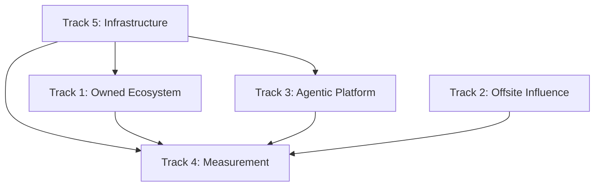

# Chapter 9: Engagement Models

> **TL;DR**
> - **POC/Pilot (8-12 weeks, $200K-$400K)**: Prove value with single LOB before enterprise commitment
> - **Enterprise Governance (16-20 weeks, $1.5M-$3M)**: Multi-track execution for organization-wide transformation
> - **Managed Services ($50K-$150K/month)**: Transition from project to continuous optimization operations
> - **Selection criteria**: Use pilot for proof-of-concept, enterprise for committed transformation, managed services for ongoing excellence

## Introduction

Selecting the right engagement model determines program success before the first line of code is written. The wrong model creates mismatched expectations, governance friction, and budgetary strain. The right model aligns scope, timeline, team structure, and budget with organizational readiness and strategic objectives.

This chapter provides a decision framework for selecting and executing three primary engagement models: POC/Pilot for validation, Enterprise Governance for transformation, and Managed Services for sustained operations. Each model serves distinct strategic needs and organizational contexts.

The engagement model you select influences every aspect of delivery: team composition, governance structure, risk tolerance, knowledge transfer approach, and success metrics. Understanding these patterns enables confident scoping and realistic expectation-setting with stakeholders.

## 9.1 POC/Pilot Scope (8-12 weeks)

### When to use pilot approach

The POC/Pilot model validates GEO value before enterprise-scale investment. This approach is appropriate when:

**Organizational uncertainty exists**: Leadership understands the GEO imperative but needs concrete proof of impact before committing to transformation. The pilot provides measurable citation lift and share of voice improvement as evidence.

**Single LOB ownership is available**: One line of business has budget authority and willingness to sponsor the pilot. This focused scope enables faster decision-making and clearer attribution of results.

**Technical integration questions remain**: Questions about LLM platform selection, vector database performance, or integration patterns need validation before enterprise standardization.

**Budget constraints require phasing**: Full enterprise investment exceeds current fiscal year allocation. A successful pilot builds the business case for subsequent funding.

**New vendor relationship**: Client needs to validate delivery capability and team fit before larger engagement commitment.

> **Warning**: Do not use pilot approach when leadership has already committed to enterprise transformation. Pilot governance overhead slows delivery without adding validation value.

### Scope boundaries and success criteria

A well-defined pilot balances meaningful scope with manageable complexity:

#### Scope inclusions

**Single line of business**: Focus on one product category or business unit. For retail clients, this typically means one product vertical (footwear, apparel, equipment). For B2B, one solution area or customer segment.

**Content optimization track**: Implement content-first prompt derivation for 50-100 key landing pages. Extract topics and entities, generate derived prompts, optimize content for citation-worthiness.

**Measurement infrastructure**: Deploy prompt bank (400+ prompts), configure measurement platform integration, establish baseline share of voice, implement weekly scanning.

**Agentic capability (limited)**: Build basic product discovery agent with semantic search over pilot LOB catalog. Demonstrate AI-to-agent interaction for simple recommendation queries.

**Knowledge transfer**: Deliver runbook documentation and conduct walkthrough session to enable client team operation post-pilot.

#### Scope exclusions

**Multi-LOB coordination**: Enterprise taxonomy harmonization and cross-LOB governance deferred to enterprise phase.

**Production-grade infrastructure**: Pilot uses existing cloud environments with pilot-appropriate SLAs. Production infrastructure hardening occurs in enterprise phase.

**Comprehensive testing**: Automated test suites and formal QA processes replaced by manual validation and smoke testing.

**Advanced agentic features**: Transactional capabilities, multi-step reasoning, and complex tool orchestration reserved for enterprise scope.

**Managed services transition**: Post-pilot support limited to 1-week hypercare. Ongoing optimization requires separate managed services engagement.

#### Success criteria

Establish quantitative go/no-go criteria before pilot kickoff:

| Metric | Baseline | Target | Measurement Period |
|--------|----------|--------|-------------------|
| Share of Voice (SOV) | Measured Week 0 | 15-25% improvement | Week 8-12 average |
| Citation Rate | Measured Week 0 | 20-30% improvement | Week 8-12 average |
| Agent Response Quality | N/A | 80%+ relevance score | Week 10-12 evaluation |
| Content Coverage | Current state | 100% of pilot pages optimized | Week 8 completion |
| Stakeholder Satisfaction | N/A | 4.0/5.0 average | Post-pilot survey |

### Typical budget range ($200K-$400K)

Pilot budget reflects focused scope and streamlined team:

#### Budget composition

**Team costs (65-70%)**: 4-6 FTE blend with 80% onshore, 20% nearshore allocation:
- Delivery Lead (0.5 FTE, weeks 1-12): $70K-$90K
- GEO Strategist (0.75 FTE, weeks 1-4, 9-12): $60K-$75K
- Content Strategist (0.75 FTE, weeks 2-8): $55K-$70K
- Technical Architect (0.5 FTE, weeks 1-3, 10-12): $50K-$65K
- AI/ML Engineer (1.0 FTE, weeks 3-10): $80K-$100K
- Data Engineer (0.75 FTE, weeks 2-8): $60K-$75K

**Platform and tooling costs (15-20%)**:
- Measurement platform subscription (3 months): $15K-$25K
- LLM API consumption (development + pilot execution): $10K-$20K
- Vector database hosting (pilot scale): $5K-$10K
- Development environment costs: $5K-$10K

**Contingency and program management (15-20%)**:
- Risk buffer for scope adjustments: 10%
- Program management overhead: 5-10%

#### Budget scaling factors

**Higher end ($350K-$400K)**:
- Complex technical environment requiring extensive integration
- Client team requires extensive enablement and training
- Multiple stakeholder groups requiring coordination
- Compressed timeline requiring resource acceleration

**Lower end ($200K-$250K)**:
- Modern cloud infrastructure with existing LLM platform access
- Technically sophisticated client team requiring minimal handholding
- Single decision-maker reducing governance overhead
- Extended timeline allowing efficient resource utilization

### Phase breakdown and timeline

The pilot follows a compressed 8-12 week execution model:

#### Phase 0: Design (Week 1-2)

**Objective**: Align on architecture and establish integration contracts

**Key activities**:
- Solution design workshop with client technical and business stakeholders
- Architecture documentation including data flow, API contracts, infrastructure pattern
- Taxonomy mapping from client product catalog to GEO optimization structure
- Integration specification for existing systems (PIM, CMS, analytics)
- Success criteria validation and measurement approach finalization

**Deliverables**:
- Architecture document (signed by client technical lead)
- Integration contract specifications
- Taxonomy mapping workbook
- Risk register with identified mitigation strategies

**Team allocation**: Delivery Lead (50%), Technical Architect (100%), GEO Strategist (50%)

#### Phase 1: Mobilization (Week 2-3)

**Objective**: Team onboarding and artifact collection

**Key activities**:
- Team kickoff and roles clarification
- Collect input artifacts: product catalog export, existing content audit, competitor list
- Establish development environment and grant necessary access
- Validate measurement platform API access and baseline scan execution
- RACI finalization and communication cadence establishment

**Deliverables**:
- Team onboarded and productive
- Input artifacts validated and accessible
- Development environment operational
- Baseline measurement scan completed
- Communication plan established (weekly status, Slack channel, escalation path)

**Team allocation**: Full team at 50% as members join

#### Phase 2: Data Foundation (Week 3-4)

**Objective**: Build data pipelines and establish vector store

**Key activities**:
- Implement product catalog ingestion pipeline
- Configure vector database with appropriate indexing strategy
- Generate embeddings for pilot product set
- Implement content extraction from pilot landing pages
- Validate semantic search quality over pilot data set

**Deliverables**:
- Product data pipeline operational (batch and incremental)
- Vector store configured and populated with pilot data
- Sample semantic queries validated (precision and recall acceptable)
- Data quality report identifying gaps requiring remediation

**Team allocation**: Data Engineer (100%), AI/ML Engineer (50%), Technical Architect (25%)

#### Phase 3: Core Build (Week 5-7)

**Objective**: Implement GEO optimization and basic agent capability

**Key activities**:
- Execute content-first prompt derivation for pilot pages
- Optimize content for citation-worthiness based on derived prompts
- Build basic product discovery agent with semantic search
- Implement prompt bank management and scanning automation
- Configure measurement dashboard with SOV and citation tracking

**Deliverables**:
- Prompt bank generated (400+ prompts) and validated for semantic alignment
- Content optimization recommendations delivered and implemented
- Product discovery agent functional for pilot queries
- Automated scanning operational with weekly cadence
- Measurement dashboard accessible to client stakeholders

**Team allocation**: Content Strategist (100%), AI/ML Engineer (100%), GEO Strategist (50%), Data Engineer (50%)

#### Phase 4: Measurement & Polish (Week 8-9)

**Objective**: Validate end-to-end flow and establish reporting

**Key activities**:
- End-to-end testing of agent interactions
- Measurement data validation and reporting template finalization
- Performance tuning based on pilot query patterns
- Documentation creation: runbook, architecture guide, operation manual
- User acceptance testing with client team

**Deliverables**:
- End-to-end flow validated with realistic scenarios
- KPI dashboard finalized with client approval
- Performance benchmarks documented
- Complete documentation package (runbook, architecture, operations)
- UAT sign-off from client stakeholders

**Team allocation**: AI/ML Engineer (75%), GEO Strategist (75%), Delivery Lead (75%), Technical Architect (50%)

#### Phase 5: Pilot Execution (Week 10-12)

**Objective**: Generate measurement data demonstrating impact

**Key activities**:
- Weekly measurement scans with trend analysis
- Optimization iteration based on measurement insights
- Competitive benchmarking and gap analysis
- Final readout preparation with ROI analysis
- Knowledge transfer session with client operations team
- Go/no-go recommendation for enterprise phase

**Deliverables**:
- Three measurement cycles with documented SOV improvement
- Optimization recommendations for enterprise phase
- Final readout presentation with business case for scaling
- Knowledge transfer completed
- Hypercare plan for 1-week post-pilot period

**Team allocation**: GEO Strategist (100%), Delivery Lead (100%), Content Strategist (50%), AI/ML Engineer (25%)

### Key deliverables

Pilot deliverables balance proof-of-value with knowledge transfer:

**Working systems**:
- Product discovery agent with semantic search over pilot catalog
- Automated measurement infrastructure with weekly scanning
- Content optimization applied to pilot landing pages
- Prompt bank generation and management capability

**Documentation**:
- Architecture documentation with deployment topology
- Runbook for operations team (monitoring, troubleshooting, maintenance)
- Measurement methodology guide explaining KPI calculation
- Optimization playbook with tactical recommendations

**Insights and recommendations**:
- Baseline-to-pilot SOV improvement analysis
- Competitive positioning assessment
- Content gap analysis identifying optimization opportunities
- Enterprise phase recommendations with prioritized roadmap

**Knowledge transfer**:
- Operations walkthrough session (2-3 hours)
- Q&A office hours during hypercare week
- Handoff documentation for client team ownership

### Go/no-go criteria for scaling

Establish objective criteria for enterprise phase commitment:

#### Quantitative thresholds

**Must achieve**:
- Share of voice improvement: Minimum 15% from baseline
- Citation rate improvement: Minimum 20% from baseline
- Agent response relevance: Minimum 75% for pilot queries
- System uptime during pilot: Minimum 95%

**Should achieve**:
- Share of voice improvement: 20-25% from baseline
- Citation rate improvement: 25-30% from baseline
- Agent response relevance: 80%+ for pilot queries
- Stakeholder satisfaction: 4.0/5.0 average

#### Qualitative assessments

**Organizational readiness**:
- Client team demonstrated capability to operate pilot systems
- Stakeholder engagement remained strong throughout pilot
- Budget authority identified for enterprise phase
- Executive sponsorship confirmed for transformation initiative

**Technical validation**:
- Architecture pattern proven scalable to enterprise requirements
- Integration approach validated with client systems
- LLM platform and vector database performed acceptably
- No blocking technical risks identified

**Strategic alignment**:
- Pilot results align with business case projections
- Competitive landscape analysis supports continued investment
- GEO initiative aligns with broader digital transformation roadmap
- Resource availability confirmed for enterprise execution

#### Decision matrix

| Criterion | Weight | Threshold | Score | Weighted Score |
|-----------|--------|-----------|-------|----------------|
| SOV Improvement | 25% | 15% minimum | Actual % | Weight × (Score/Threshold) |
| Citation Improvement | 25% | 20% minimum | Actual % | Weight × (Score/Threshold) |
| Agent Quality | 20% | 75% minimum | Actual % | Weight × (Score/Threshold) |
| Stakeholder Satisfaction | 15% | 3.5/5.0 minimum | Actual score | Weight × (Score/Threshold) |
| Org Readiness | 15% | Qualitative assessment | 1-5 scale | Weight × (Score/5) |

**Go criteria**: Weighted score 0.85 or higher
**Conditional go**: Weighted score 0.70-0.84 with mitigation plan for gaps
**No-go**: Weighted score below 0.70

> **Note**: Conditional go requires formal mitigation plan addressing gaps before enterprise phase kickoff.

## 9.2 Enterprise Governance (16-20 weeks)

### When enterprise scope is appropriate

The Enterprise Governance model is appropriate when organizational commitment to GEO transformation is established:

**Strategic imperative confirmed**: Leadership recognizes GEO as strategic capability requiring enterprise-wide deployment. This commitment typically follows successful pilot or market pressure from competitors.

**Multi-LOB coordination required**: Multiple lines of business need unified GEO strategy with shared taxonomy, measurement approach, and technical infrastructure.

**Production-grade requirements**: Business-critical use cases demand enterprise SLAs, comprehensive testing, security hardening, and operational excellence.

**Center of Excellence establishment**: Organization plans to build internal GEO capability requiring formal knowledge transfer, training programs, and ongoing enablement.

**Budget authorization complete**: Full enterprise budget ($1.5M-$3M) approved with executive sponsorship and governance structure in place.

### Multi-track parallel execution

Enterprise delivery requires parallel workstreams managed through portfolio governance:

#### Track structure

**Track 1: Owned Ecosystem Optimization**
- Content audit and gap analysis across all LOBs
- Content-first prompt derivation at enterprise scale (200+ pages)
- Structured data implementation (Schema.org, product markup)
- Content optimization with editorial workflow integration
- CMS integration for ongoing content governance

**Track 2: Offsite Influence Strategy**
- Third-party signal analysis (reviews, media mentions, industry content)
- Partnership and placement strategy for citation building
- PR and content marketing alignment for AI visibility
- Review and rating optimization across platforms

**Track 3: Agentic Commerce Platform**
- Production-grade product discovery agent with advanced reasoning
- Transactional capability for agent-to-agent commerce
- Multi-step journey orchestration (research to purchase)
- Tool ecosystem integration (inventory, pricing, recommendations)
- Performance optimization for production load

**Track 4: Measurement & Intelligence**
- Enterprise prompt bank (1000+ prompts across LOBs)
- Automated scanning infrastructure with daily cadence
- Competitive intelligence platform integration
- Executive dashboard with LOB-level drill-down
- Attribution modeling connecting citation to downstream metrics

**Track 5: Infrastructure & Operations**
- Production infrastructure with enterprise SLAs
- Security hardening and compliance validation
- Disaster recovery and business continuity planning
- Monitoring and alerting infrastructure
- DevOps automation and CI/CD pipeline

#### Track dependencies



Track 5 (Infrastructure) is the critical path foundation. Tracks 1, 2, and 3 can execute in parallel once infrastructure is ready. Track 4 (Measurement) depends on all content and agent tracks producing outputs to measure.

### Typical budget range ($1.5M-$3M)

Enterprise budget reflects complexity, team scale, and production requirements:

#### Budget composition

**Team costs (60-65%)**: 10-17 FTE blend with 55% onshore, 45% nearshore allocation

*Leadership and strategy (20% of team cost)*:
- Delivery Lead (1.0 FTE, weeks 1-20): $180K-$220K
- Technical Architect (0.75 FTE, weeks 1-16): $130K-$160K
- GEO Strategist (0.75 FTE, weeks 1-20): $130K-$160K

*Owned ecosystem track (25% of team cost)*:
- Content Strategist (1.0 FTE, weeks 2-18): $150K-$180K
- Content Analyst (nearshore, 2.0 FTE, weeks 3-16): $120K-$150K
- Structured Data Specialist (0.5 FTE, weeks 4-14): $60K-$75K

*Agentic platform track (30% of team cost)*:
- AI/ML Engineer - Lead (1.0 FTE, weeks 3-18): $180K-$220K
- AI/ML Engineer (nearshore, 2.0 FTE, weeks 4-16): $160K-$200K
- Integration Developer (1.0 FTE, weeks 5-16): $140K-$170K

*Measurement track (15% of team cost)*:
- Data Engineer (1.0 FTE, weeks 2-18): $150K-$180K
- Analytics Specialist (0.75 FTE, weeks 8-20): $100K-$125K

*Infrastructure and QA (10% of team cost)*:
- DevOps Engineer (0.75 FTE, weeks 1-20): $130K-$160K
- QA Lead (0.5 FTE, weeks 8-18): $75K-$95K

**Platform and tooling costs (20-25%)**:
- Measurement platform (enterprise tier, 12 months): $120K-$180K
- LLM API consumption (development, testing, production): $80K-$150K
- Vector database (production tier with HA): $40K-$70K
- Cloud infrastructure (compute, storage, networking): $60K-$100K
- Development and testing environments: $30K-$50K
- Security and compliance tooling: $20K-$40K

**Knowledge transfer and enablement (5-8%)**:
- Training program development: $40K-$60K
- Documentation and runbook creation: $30K-$50K
- Center of Excellence establishment: $30K-$60K
- Ongoing office hours and support: $20K-$40K

**Contingency and program management (10-15%)**:
- Risk buffer for scope adjustments: 10%
- Program management overhead: 5%

#### Budget scaling factors

**Higher end ($2.5M-$3M)**:
- Global deployment with regional customization requirements
- Complex enterprise integration landscape (10+ systems)
- Compliance requirements (GDPR, CCPA, industry-specific regulations)
- Extensive custom development beyond platform capabilities
- Large organization requiring extensive change management

**Lower end ($1.5M-$2M)**:
- Single-region deployment with limited localization
- Modern cloud-native infrastructure with existing LLM platform
- Standard integration patterns without custom development
- Streamlined governance with strong executive sponsorship
- Technically sophisticated client team

### Phase breakdown and timeline

Enterprise delivery extends pilot structure with additional governance and scale:

#### Phase 0: Enterprise Design (Week 1-2)

**Objective**: Establish enterprise architecture and governance framework

**Key activities**:
- Enterprise architecture workshop with IT, business, and security stakeholders
- Multi-LOB taxonomy harmonization and content strategy alignment
- Integration architecture for enterprise systems (PIM, CMS, OMS, CDP, analytics)
- Security and compliance review with architecture approval
- Governance framework establishment (steering committee, CCB, RACI)
- Track planning with dependency mapping and resource allocation

**Deliverables**:
- Enterprise architecture document (signed by CTO/IT leadership)
- Integration specifications for all systems
- Enterprise taxonomy and content model
- Security and compliance sign-off
- Governance charter with decision-making authority
- Detailed project plan with track schedules and milestones

**Track leads**: Delivery Lead, Technical Architect, GEO Strategist, client IT leadership

#### Phase 1: Mobilization (Week 2-3)

**Objective**: Team formation and environment establishment

**Key activities**:
- Full team onboarding with track-specific orientation
- Enterprise artifact collection across all LOBs
- Development, testing, and production environment provisioning
- Access and permissions establishment across client systems
- Baseline measurement across all LOBs and competitors
- Communication infrastructure setup (status reporting, collaboration tools, escalation)

**Deliverables**:
- All teams operational and productive
- Complete artifact library accessible to all tracks
- All environments validated and accessible
- Enterprise baseline measurement completed
- Communication cadence established (weekly status, biweekly steering, monthly governance)

**All tracks**: 50% allocation for mobilization

#### Phase 2: Infrastructure Foundation (Week 3-5)

**Objective**: Build production-grade infrastructure foundation

**Key activities**:
- Production infrastructure deployment (cloud resources, networking, security)
- DevOps automation and CI/CD pipeline establishment
- Monitoring and alerting infrastructure configuration
- Disaster recovery and backup strategy implementation
- Security hardening and penetration testing
- Performance baseline and capacity planning

**Deliverables**:
- Production infrastructure operational with enterprise SLAs
- CI/CD pipeline functional for automated deployment
- Monitoring dashboards operational with alerting
- DR plan documented and tested
- Security assessment passed
- Infrastructure documentation complete

**Primary track**: Track 5 (Infrastructure) at 100%
**Supporting tracks**: All other tracks at 25% for coordination

#### Phase 3: Parallel Track Execution (Week 6-14)

**Objective**: Execute all content, platform, and measurement workstreams

**Track 1: Owned Ecosystem (Week 6-14)**
- Content audit across all LOBs with gap analysis
- Content-first prompt derivation at enterprise scale
- Structured data implementation across product catalog
- Content optimization with A/B testing framework
- CMS integration and editorial workflow establishment

**Track 2: Offsite Influence (Week 6-14)**
- Third-party signal audit (reviews, media, partnerships)
- Citation building strategy with execution plan
- PR and content marketing playbook alignment
- Review platform optimization and management process

**Track 3: Agentic Platform (Week 6-14)**
- Advanced agent development with multi-step reasoning
- Tool ecosystem integration (inventory, pricing, recommendations)
- Transactional capability implementation
- Agent testing and quality assurance
- Performance optimization for production load

**Track 4: Measurement (Week 6-14)**
- Enterprise prompt bank generation (1000+ prompts)
- Automated scanning infrastructure deployment
- Executive dashboard development with LOB drill-down
- Competitive intelligence integration
- Attribution modeling connecting citation to conversion

**Track 5: Infrastructure (Week 6-14)**
- Ongoing infrastructure optimization and scaling
- Security monitoring and incident response
- DevOps support for all tracks
- Performance tuning based on load testing

**Deliverables by track**:
- Track 1: All LOB content optimized, structured data deployed, CMS integration complete
- Track 2: Offsite strategy executed, partnership placements secured, review optimization ongoing
- Track 3: Production agent deployed with full feature set, performance benchmarks met
- Track 4: Measurement platform operational, executive dashboard live, baseline-to-current trending
- Track 5: Infrastructure scaled for production load, all SLAs met, security compliance validated

**Team allocation**: All tracks at 100% during parallel execution phase

#### Phase 4: Integration & Testing (Week 15-17)

**Objective**: End-to-end validation and production readiness

**Key activities**:
- Integration testing across all tracks
- User acceptance testing with business stakeholders
- Load and performance testing at expected production volume
- Security testing and compliance validation
- Documentation finalization (runbooks, architecture, operations)
- Production deployment planning and cutover preparation

**Deliverables**:
- Integration testing passed with all critical workflows validated
- UAT sign-off from business stakeholders
- Performance benchmarks met for production load
- Security and compliance certification
- Complete documentation package
- Production cutover plan approved

**All tracks**: 75% allocation for integration and testing

#### Phase 5: Production Rollout (Week 18-20)

**Objective**: Phased production deployment with validation

**Key activities**:
- LOB-phased production rollout (typically 2-3 LOBs per week)
- Production monitoring and performance validation
- Stakeholder training and enablement sessions
- Center of Excellence establishment with operational handoff
- Hypercare support during initial production period
- Final readout with ROI analysis and optimization roadmap

**Deliverables**:
- All LOBs in production with measurement operational
- Production performance validated against SLAs
- Client team trained and operating systems
- Center of Excellence operational with defined charter
- Hypercare completed successfully
- Final readout delivered with managed services transition plan

**Team allocation**: Delivery Lead (100%), all tracks at 50-75% for rollout support and knowledge transfer

### Governance requirements

Enterprise governance balances agility with accountability:

#### Steering committee

**Composition**:
- Executive sponsor (client)
- Delivery Lead (delivery partner)
- IT leadership (client)
- LOB leaders (one per major business unit)
- Finance/procurement representative

**Cadence**: Biweekly throughout engagement

**Responsibilities**:
- Major milestone approval (phase gate decisions)
- Budget variance approval beyond threshold (typically >5%)
- Strategic risk escalation and mitigation approval
- Scope change approval for enterprise-level changes

#### Change control board (CCB)

**Composition**:
- Delivery Lead (chair)
- Technical Architect
- Client technical lead
- LOB representatives as needed for specific changes

**Cadence**: Weekly or as-needed for urgent changes

**Responsibilities**:
- Change request evaluation (impact, cost, timeline)
- Approval authority for changes within delegated threshold
- Escalation to steering committee for major changes
- Change log maintenance and communication

#### Change request thresholds

| Change Type | Budget Impact | Timeline Impact | Approval Authority |
|-------------|---------------|-----------------|-------------------|
| Minor | <$25K | <1 week | Delivery Lead |
| Moderate | $25K-$100K | 1-2 weeks | CCB |
| Major | >$100K | >2 weeks | Steering Committee |
| Critical path | Any | Impacts go-live | Steering Committee |

#### Risk management

**Risk register maintenance**:
- Weekly risk review in status meetings
- Risk scoring: Probability (1-5) × Impact (1-5) = Risk Score
- Active mitigation tracking for risks scoring 15+
- Escalation to steering committee for risks scoring 20+

**Risk categories**:
- Technical: Integration complexity, platform limitations, performance issues
- Resource: Team availability, skill gaps, onboarding delays
- Organizational: Stakeholder engagement, decision-making delays, change resistance
- External: Third-party dependencies, market changes, competitive moves

#### Status reporting

**Weekly status report**:
- Track-level progress against plan (on track, at risk, blocked)
- Key accomplishments and planned activities
- Issues requiring escalation or support
- Budget and timeline variance summary

**Monthly governance report**:
- Executive summary for steering committee
- Overall program health (green/yellow/red)
- Milestone achievement and upcoming critical milestones
- Budget variance analysis with forecast
- Risk register summary with active mitigation status
- Decision log and open action items

### LOB rollout strategy

Phased LOB rollout reduces risk and enables learning:

#### Sequencing criteria

**Phase 1 LOB selection** (Week 18):
- Strong stakeholder engagement and sponsorship
- Moderate complexity (not simplest, not most complex)
- Meaningful business impact to demonstrate value
- Representative of enterprise challenges (integration, data quality, content gaps)

**Phase 2 LOB selection** (Week 19):
- Builds on Phase 1 learnings
- Higher complexity or strategic importance
- Different use case or product category for pattern validation

**Phase 3+ LOB selection** (Week 20+):
- Remaining LOBs in order of business priority
- May extend beyond initial engagement into managed services

#### Rollout gates

Each LOB rollout requires gate approval:

**Pre-rollout checklist**:
- [ ] LOB-specific content optimization completed
- [ ] Prompt bank validated for LOB topics
- [ ] Agent testing passed for LOB products
- [ ] Baseline measurement established for LOB
- [ ] Stakeholder training completed
- [ ] Runbook validated for LOB-specific scenarios
- [ ] Production monitoring configured for LOB metrics

**Post-rollout validation** (1-week observation):
- Performance metrics within acceptable range
- No critical incidents during observation period
- Stakeholder satisfaction acceptable
- Measurement trending positively

**Go criteria for next LOB**:
- Current LOB post-rollout validation passed
- No blocking issues identified
- Resources available for next rollout
- Steering committee approval obtained

#### Rollback planning

Each rollout requires documented rollback procedure:

**Rollback triggers**:
- Critical system failure impacting user experience
- Data quality issues requiring remediation
- Performance degradation beyond acceptable threshold
- Security incident requiring investigation

**Rollback execution**:
- Revert to pre-rollout agent configuration
- Disable LOB-specific features while maintaining core functionality
- Communicate rollback to stakeholders with remediation plan
- Root cause analysis and fix before retry

## 9.3 Managed Services (Ongoing)

### Transition from project to operations

Managed services enable sustained GEO excellence after project delivery:

**The operations gap**: Project teams build capabilities, but ongoing optimization requires continuous measurement, analysis, and refinement. Without managed services, GEO performance typically degrades 20-30% within 6 months as AI platforms evolve and competitive landscape shifts.

**Transition planning**: Managed services transition planning begins in final project phase:

**Week 16-17 (Enterprise) or Week 10-11 (Pilot)**:
- Identify operations team composition and responsibilities
- Document standard operating procedures and escalation paths
- Establish SLA definitions and performance baselines
- Define monthly optimization cadence and review process

**Week 18-20 (Enterprise) or Week 12 (Pilot)**:
- Shadow operations with project team support
- Validate monitoring and alerting effectiveness
- Conduct tabletop exercises for common scenarios
- Transfer knowledge through paired execution

**Post-project hypercare**:
- 1-2 weeks of enhanced support availability
- Daily check-ins during initial operations period
- Rapid response to questions and issues
- Documentation refinement based on operations questions

### Scope of managed services

Managed services maintain and optimize GEO performance:

#### Core services (included in base retainer)

**Measurement and reporting**:
- Weekly automated measurement scans across full prompt bank
- Monthly performance report with SOV, citation rate, competitive benchmarking
- Quarterly business review with executive readout
- Trend analysis and variance investigation

**Content optimization**:
- Monthly content gap analysis identifying optimization opportunities
- Quarterly prompt bank refresh based on search trends and AI evolution
- Continuous A/B testing of content variations
- Structured data validation and correction

**Agent operations**:
- 24/7 monitoring with alerting for critical issues
- Performance optimization based on query patterns
- Query quality analysis and improvement recommendations
- Platform integration maintenance as APIs evolve

**Platform maintenance**:
- Infrastructure monitoring and proactive maintenance
- Security patching and vulnerability remediation
- Platform upgrades and feature adoption
- Backup validation and disaster recovery testing

#### Enhanced services (available as add-ons)

**Expansion optimization** (+$20K-$40K/month):
- New LOB onboarding and optimization
- International market expansion with localization
- New product category launches with GEO readiness

**Competitive intelligence** (+$15K-$30K/month):
- Deep competitive analysis with strategic recommendations
- Emerging competitor monitoring and threat assessment
- Competitive benchmarking with quarterly strategic review

**Advanced analytics** (+$25K-$50K/month):
- Attribution modeling connecting citation to conversion
- Customer journey analysis including AI touchpoints
- ROI reporting with business impact quantification
- Predictive analytics for trend forecasting

**Strategic consulting** (+$30K-$60K/month):
- Monthly strategy sessions with senior GEO strategist
- Roadmap development for emerging AI platforms
- Innovation pilots for new agentic capabilities
- Executive advisory for GEO program evolution

### Typical budget range ($50K-$150K/month)

Managed services budget scales with scope and LOB coverage:

#### Base retainer structure

**Small deployment** ($50K-$75K/month):
- 1-2 LOBs with 500-1000 prompts in bank
- 3-4 FTE team (nearshore/offshore blend)
- Weekly measurement, monthly reporting
- Standard SLAs (business hours support, 4-hour response)
- Quarterly business reviews

**Mid-size deployment** ($75K-$125K/month):
- 3-5 LOBs with 1000-2000 prompts in bank
- 4-6 FTE team (mixed shore)
- Daily measurement, weekly reporting, monthly deep-dive
- Enhanced SLAs (extended hours support, 2-hour response)
- Monthly business reviews with quarterly strategic planning

**Enterprise deployment** ($125K-$150K/month):
- 6+ LOBs with 2000+ prompts in bank
- 6-8 FTE team (onshore leadership, nearshore delivery)
- Continuous measurement, real-time dashboards, weekly strategic review
- Premium SLAs (24/7 support, 1-hour response for critical)
- Biweekly strategic sessions with quarterly executive reviews

#### Team composition

**Managed services team** (base retainer):
- Engagement Manager (0.25 FTE onshore): Client relationship, escalation, strategic guidance
- GEO Analyst (0.75 FTE nearshore): Measurement analysis, reporting, optimization recommendations
- Content Specialist (0.5-1.0 FTE nearshore): Content gap analysis, prompt bank management, A/B testing
- DevOps Engineer (0.5 FTE nearshore/offshore): Infrastructure monitoring, maintenance, platform updates
- AI/ML Engineer (0.5 FTE nearshore): Agent optimization, performance tuning, quality improvement

**Enhanced team** (with add-on services):
- Senior GEO Strategist (0.25-0.5 FTE onshore): Strategic consulting, innovation pilots
- Data Scientist (0.5 FTE nearshore): Advanced analytics, attribution modeling
- Competitive Analyst (0.25-0.5 FTE nearshore): Competitive intelligence, market analysis

### SLA and performance expectations

Clear SLAs establish mutual expectations:

#### Response time SLAs

| Severity | Definition | Response Time | Resolution Target |
|----------|-----------|---------------|------------------|
| Critical | Production system down, major data quality issue | 1 hour | 4 hours |
| High | Feature degradation, measurement failures | 4 hours | 1 business day |
| Medium | Performance issues, minor quality problems | 1 business day | 3 business days |
| Low | Enhancement requests, documentation updates | 3 business days | 2 weeks |

#### Availability SLAs

**Production systems**:
- Agent availability: 99.5% uptime (measured monthly)
- Measurement infrastructure: 99.0% uptime (measured monthly)
- Dashboard availability: 99.0% uptime (measured monthly)

**Planned maintenance**:
- Maximum 4 hours per month during designated maintenance window
- 72-hour advance notice for planned downtime
- Critical maintenance may be scheduled outside window with 1-week notice

#### Performance SLAs

**Agent performance**:
- Query response time: 95th percentile under 2 seconds
- Relevance score: Minimum 80% for standard queries
- Error rate: Maximum 1% of queries

**Measurement accuracy**:
- Scan completion rate: 99%+ of prompts successfully scanned weekly
- Data freshness: Reports reflect data no more than 48 hours old
- Competitive data coverage: 95%+ of tracked competitors scanned successfully

#### Reporting SLAs

**Standard reporting**:
- Weekly measurement summary: Delivered by EOD Monday
- Monthly performance report: Delivered within 5 business days of month-end
- Quarterly business review: Scheduled and delivered within 2 weeks of quarter-end

**Ad-hoc analysis**:
- Response to analysis requests: 2 business days for scoping
- Delivery timeline: Agreed upon during scoping based on complexity

### Continuous optimization model

Managed services drive ongoing improvement:

#### Monthly optimization cycle

**Week 1: Measurement and analysis**
- Review monthly performance data across all LOBs
- Identify performance gaps and opportunities
- Conduct competitive analysis highlighting threats and opportunities
- Prioritize optimization opportunities based on potential impact

**Week 2: Strategy and planning**
- Develop optimization recommendations for priority opportunities
- Design A/B tests for content variations
- Plan prompt bank updates based on emerging topics
- Align with client stakeholders on optimization priorities

**Week 3: Execution**
- Implement approved content optimizations
- Launch A/B tests with measurement framework
- Update prompt bank with new queries
- Execute agent performance improvements

**Week 4: Validation and reporting**
- Monitor optimization impact through measurement
- Analyze A/B test results and determine winners
- Prepare monthly performance report
- Conduct monthly business review with client stakeholders

#### Quarterly strategic cycle

**Q1 activities (in addition to monthly cycle)**:
- Annual goal setting and KPI target establishment
- Competitive landscape assessment with annual trends
- Technology roadmap review and platform update planning

**Q2 activities**:
- Mid-year performance review against annual targets
- Emerging AI platform evaluation (new LLMs, agent frameworks)
- Content strategy refresh based on market evolution

**Q3 activities**:
- Annual planning kickoff with budget forecasting
- Innovation pilot planning for new capabilities
- Tool and platform vendor review

**Q4 activities**:
- Annual performance summary and ROI analysis
- Following-year strategy and roadmap finalization
- Budget and resource planning for next year

#### Continuous improvement mechanisms

**Performance trending**: Track performance metrics over time to identify gradual degradation before it becomes critical.

**Competitive intelligence**: Monitor competitor GEO performance to identify threats (competitor improving faster) and opportunities (competitor vulnerabilities).

**Platform evolution tracking**: Stay current with AI platform updates (new LLM models, algorithm changes, feature releases) and adapt strategy accordingly.

**Industry best practice**: Participate in GEO community, conferences, and research to bring cutting-edge approaches to client program.

**Innovation pilots**: Allocate capacity for testing emerging techniques (new prompt engineering methods, novel agent capabilities, new AI platforms).

### Exit and transition planning

Professional managed services include clean exit paths:

#### Exit scenarios

**Transition to in-house operations**:
- Client builds internal capability and wants full ownership
- Typical timeline: 3-6 months transition period
- Managed services shifts to advisory/on-call model

**Transition to different provider**:
- Client chooses alternative managed services vendor
- Typical timeline: 2-3 months transition period
- Focus on knowledge transfer and operational continuity

**Program wind-down**:
- Strategic change reduces GEO priority
- Typical timeline: 1-2 months for orderly shutdown
- Focus on data preservation and system decommissioning

#### Transition deliverables

**Documentation package**:
- Complete architecture documentation with deployment topology
- Updated runbooks reflecting current operational procedures
- Historical performance data and analysis
- Optimization playbook with proven techniques
- Vendor contact information and account details

**Knowledge transfer**:
- Paired operations period (typically 4-8 weeks)
- Training sessions for operations team
- Office hours for question resolution
- Documentation walkthrough sessions

**System handoff**:
- Access credentials transfer with security protocols
- Source code and configuration repository transfer
- Data export in agreed-upon formats
- Platform account ownership transfer coordination

**Performance baseline**:
- Final performance report establishing current state
- 30-60-90 day benchmark data for comparison
- Active optimization opportunities documentation
- Recommendations for sustaining performance post-transition

#### Transition success criteria

**Operations readiness**:
- Client team successfully completes tabletop exercises
- Client team completes 2 weeks of paired operations without escalation
- All critical procedures documented and validated
- Monitoring and alerting configured and tested

**Knowledge transfer validation**:
- Client team demonstrates capability to execute monthly optimization cycle
- Client team shows proficiency with troubleshooting common issues
- All questions documented and answered
- Training completion confirmed by all team members

**System stability**:
- No critical incidents during transition period
- Performance metrics maintained within acceptable range
- All integrations functioning correctly under client operation
- Backup and disaster recovery procedures validated

## 9.4 Hybrid Approaches

### Combining models for complex scenarios

Organizations often require hybrid engagement models:

#### Pilot-to-enterprise-to-managed continuum

The most common pattern combines all three models:

**Phase 1: Pilot validation** (8-12 weeks, $200K-$400K)
- Prove GEO value with single LOB
- Validate technical approach and team fit
- Build business case for enterprise investment

**Phase 2: Enterprise deployment** (16-20 weeks, $1.5M-$3M)
- Scale proven approach across all LOBs
- Build production-grade infrastructure
- Establish Center of Excellence and operational processes

**Phase 3: Managed services** (ongoing, $50K-$150K/month)
- Sustain and optimize performance
- Drive continuous improvement
- Enable innovation through emerging capabilities

**Advantages**:
- Risk mitigation through incremental commitment
- Learning application from pilot to enterprise
- Smooth transition to steady-state operations

**Considerations**:
- Requires 12-18 month commitment for full value
- Pilot learnings may require enterprise approach adjustment
- Budgeting complexity across multiple fiscal periods

#### Build-operate-transfer hybrid

Combines project delivery with short-term managed services before internal transition:

**Phase 1: Build** (12-20 weeks)
- Pilot or enterprise delivery model
- Simultaneous client team capability building
- Parallel internal team development

**Phase 2: Operate** (6-12 months)
- Managed services with knowledge transfer focus
- Client team shadow operations with increasing ownership
- Gradual responsibility transition

**Phase 3: Transfer** (2-3 months)
- Formal transition to client team operation
- Advisory support model for strategic guidance
- On-call support for critical issues

**Advantages**:
- Client gains operational experience with support
- Lower long-term cost than indefinite managed services
- Proven approach to building internal capability

**Considerations**:
- Requires client commitment to capability building
- Client team must be hired and available during operate phase
- Performance may dip initially after transfer

#### Hybrid scope models

Combine different engagement models across LOBs or capabilities:

**Enterprise core + managed services enhancements**:
- Enterprise project builds foundation across all LOBs
- Managed services adds continuous enhancement and emerging capability pilots
- Enables innovation without project overhead

**Pilot cycles for new markets**:
- Enterprise deployment in primary market
- Pilot approach for new international markets or verticals
- Reduces risk when expanding to unknown markets

**Managed services with project sprints**:
- Base managed services maintains core operations
- Periodic project engagements for major new capabilities
- Balances steady-state operations with strategic evolution

### Multi-LOB phased rollouts

Complex organizations require thoughtful LOB sequencing:

#### Sequencing strategies

**Champion-based rollout**:
1. Start with most engaged LOB sponsor (champion)
2. Demonstrate success and build internal advocacy
3. Use champion to evangelize to peer LOBs
4. Subsequent LOBs benefit from internal reference

**Complexity-based rollout**:
1. Start with moderate complexity LOB (not easiest, not hardest)
2. Build learnings on representative challenges
3. Apply learnings to more complex LOBs
4. Finish with simplest LOBs for quick wins

**Value-based rollout**:
1. Start with highest business impact LOB
2. Demonstrate ROI quickly to sustain executive support
3. Use ROI to justify investment in smaller LOBs
4. Build momentum through visible business outcomes

**Dependency-based rollout**:
1. Identify LOB dependencies (shared taxonomy, data sources)
2. Start with foundational LOBs that others depend on
3. Roll out dependent LOBs once foundation is stable
4. Minimize rework from dependency changes

#### Cross-LOB coordination

**Shared taxonomy governance**:
- Establish enterprise taxonomy working group with LOB representation
- Define process for taxonomy addition and modification
- Balance LOB specificity with enterprise consistency
- Version control and change management for taxonomy evolution

**Content strategy alignment**:
- Cross-LOB content audit identifying redundancy and gaps
- Shared content component library for efficiency
- Content governance model preventing duplication
- Brand voice consistency across all LOB content

**Measurement harmonization**:
- Enterprise prompt bank includes LOB-specific and cross-LOB prompts
- Standardized KPI definitions enabling cross-LOB comparison
- Consolidated reporting showing both LOB-level and enterprise-level performance
- Shared competitive set with LOB-specific competitive augmentation

**Infrastructure sharing**:
- Shared vector database with LOB-partitioned indices
- Common agent framework with LOB-specific tools
- Consolidated measurement infrastructure
- Centralized monitoring and alerting with LOB-specific thresholds

### Global/regional considerations

International deployment adds localization complexity:

#### Localization requirements

**Language and translation**:
- Native language content optimization for each market
- Culturally appropriate prompt derivation
- LLM selection based on language capabilities (some models stronger in certain languages)
- Translation quality assurance for structured data

**Regional AI platform differences**:
- Platform availability varies by region (ChatGPT restrictions in some countries)
- Local AI platforms may dominate certain markets (Baidu in China, Yandex in Russia)
- Measurement platform coverage varies by region
- API access and performance varies globally

**Cultural adaptation**:
- Product discovery patterns differ culturally (price sensitivity, brand preferences)
- Review and rating significance varies by culture
- Trust signals differ across markets (certifications, endorsements)
- Query patterns reflect cultural norms and communication styles

**Regulatory compliance**:
- Data residency requirements may mandate regional infrastructure
- Privacy regulations (GDPR, LGPD, etc.) impact data collection and usage
- AI regulations emerging in EU and other regions
- Content regulations vary (health claims, sustainability assertions)

#### Deployment patterns

**Hub-and-spoke model**:
- Central infrastructure in primary region (hub)
- Regional customization layers (spokes)
- Shared core capabilities with localized presentation
- Efficient for markets with similar characteristics

**Regional independence model**:
- Separate deployments per major region
- Regional autonomy for optimization and strategy
- Shared learnings through center of excellence
- Appropriate for highly differentiated markets

**Hybrid global-local model**:
- Global infrastructure for common capabilities
- Regional infrastructure for latency-sensitive or compliance-required components
- Centralized measurement with regional drill-down
- Balances efficiency with local responsiveness

### Partner ecosystem integration

GEO success often requires partner collaboration:

#### Content partnership integration

**Publisher and media partners**:
- Coordinate content publication for citation building
- Align on topics and keyword targets
- Track citation attribution from partner content
- Measure partner contribution to overall SOV

**Review and ratings platforms**:
- Integrate review management workflows
- Optimize review content for AI citation
- Monitor review sentiment and respond strategically
- Track review platform citation rates

**Industry associations and authorities**:
- Contribute thought leadership content to industry sources
- Pursue certifications and endorsements that build authority
- Participate in industry standard setting
- Monitor industry source citations

#### Technology partner integration

**Measurement platform providers**:
- API integration for automated scanning
- Custom prompt bank management
- Competitive set configuration
- Data export for consolidated analytics

**Content management systems**:
- Bidirectional integration for content optimization workflow
- Structured data injection
- A/B testing framework integration
- Editorial workflow automation

**E-commerce platforms**:
- Product catalog synchronization
- Inventory and pricing data feeds
- Transaction data for attribution analysis
- Customer review integration

**Analytics and data platforms**:
- Measurement data integration into enterprise analytics
- Attribution modeling connecting citation to downstream metrics
- Customer journey analysis including AI touchpoints
- Executive dashboard integration

#### Governance across partners

**Partner onboarding**:
- Clear scope of work and deliverables
- SLA establishment and monitoring
- Access and permission management
- Integration testing and validation

**Ongoing coordination**:
- Regular sync meetings with key partners
- Escalation paths for issues
- Performance monitoring and feedback
- Continuous optimization collaboration

**Partner performance management**:
- KPI tracking for partner deliverables
- Business reviews with strategic partners
- Feedback loops for improvement
- Partnership value assessment and optimization

## Engagement Model Decision Framework

### Selection decision tree

Use this decision tree to identify the appropriate engagement model:

```
START: Does leadership have high confidence in GEO value?
├─ NO: Has similar initiative (SEO, content optimization) succeeded previously?
│  ├─ NO → Pilot engagement (prove value first)
│  └─ YES: Is budget authorized for enterprise deployment?
│     ├─ NO → Pilot engagement (build business case)
│     └─ YES → Consider enterprise, but pilot reduces risk
└─ YES: Is multi-LOB coordination required?
   ├─ NO: Single LOB scope sufficient?
   │  └─ YES → Pilot may be appropriate despite confidence
   └─ YES: Is enterprise budget authorized?
      ├─ NO → Multi-phase approach (pilot first, then enterprise)
      └─ YES: Do you have internal capability to sustain operations?
         ├─ NO → Enterprise + Managed Services
         ├─ BUILDING → Enterprise + Build-Operate-Transfer
         └─ YES → Enterprise with transition to internal ops
```

### Comparative model analysis

| Dimension | POC/Pilot | Enterprise Governance | Managed Services |
|-----------|-----------|----------------------|------------------|
| **Duration** | 8-12 weeks | 16-20 weeks | Ongoing (monthly) |
| **Budget** | $200K-$400K | $1.5M-$3M | $50K-$150K/month |
| **Team Size** | 4-6 FTE | 10-17 FTE | 3-8 FTE |
| **LOB Coverage** | 1 LOB | Multiple LOBs | Covers deployed LOBs |
| **Infrastructure** | Pilot-grade | Production-grade | Maintains production |
| **Governance** | Lightweight (weekly status) | Formal (steering, CCB) | SLA-driven |
| **Primary Goal** | Prove value | Deploy capability | Sustain performance |
| **Success Metric** | SOV improvement % | Production deployment | Continuous optimization |
| **Knowledge Transfer** | Runbook + walkthrough | Training program + CoE | Paired operations |
| **Best For** | Validation, new vendor | Committed transformation | Ongoing excellence |
| **Risk Level** | Low financial risk | Higher investment | Predictable monthly |
| **Exit Flexibility** | End after pilot | Natural endpoint | Month-to-month or annual |

### Budget planning timeline

**Fiscal year 1 planning**:
- Q1: Pilot execution ($200K-$400K)
- Q2: Pilot results analysis, enterprise business case development
- Q3: Enterprise phase 1 execution (begins, $750K-$1.5M in FY1)
- Q4: Enterprise phase 1 completion, managed services initiation

**Fiscal year 2 planning**:
- Q1-Q2: Managed services operations ($300K-$900K)
- Q3: Build-operate-transfer begins (if transitioning to internal)
- Q4: Full internal operations or continued managed services

**Multi-year TCO analysis**:
- Year 1: $1.2M-$2.4M (pilot + enterprise start)
- Year 2: $1.8M-$3.6M (enterprise completion + managed services)
- Year 3+: $600K-$1.8M annually (managed services or internal operations)

### Risk-based model selection

Match engagement model to organizational risk tolerance:

**Low risk tolerance** → Start with pilot
- Validates approach before major investment
- Enables vendor evaluation
- Provides concrete ROI data for enterprise business case
- Lower initial commitment

**Moderate risk tolerance** → Enterprise with defined gates
- Phase gates enable stop/adjust decisions
- Parallel tracks reduce timeline without increasing risk
- Pilot learnings from industry applied directly
- Faster time-to-value than pilot-first approach

**High risk tolerance** → Enterprise with aggressive timeline
- Compressed phases for faster deployment
- Higher resource allocation to accelerate delivery
- Accepts higher investment risk for competitive advantage
- Requires strong executive sponsorship and decision-making speed

## Next Steps

### Immediate actions

**For organizations considering GEO engagement**:

1. **Assess organizational readiness** (Week 1):
   - Evaluate executive sponsorship and commitment level
   - Identify LOB champions and stakeholder landscape
   - Review budget authority and fiscal year timing
   - Assess current technical infrastructure and AI maturity

2. **Determine engagement model** (Week 1-2):
   - Use decision tree and comparative analysis from this chapter
   - Consider risk tolerance and budget constraints
   - Evaluate timeline requirements and competitive pressure
   - Align model selection with organizational culture

3. **Build internal business case** (Week 2-4):
   - Quantify opportunity cost of delayed GEO investment
   - Benchmark competitive GEO performance
   - Project ROI based on citation rate improvements
   - Develop 3-year budget and resource plan

4. **Initiate vendor selection** (Week 4-6):
   - Develop RFP or SOW based on selected engagement model
   - Evaluate vendors on GEO expertise, delivery capability, cultural fit
   - Review case studies and reference clients
   - Negotiate terms and finalize contract

5. **Plan mobilization** (Week 6-8):
   - Identify client-side team members and allocations
   - Prepare artifact collection (product catalog, content inventory, competitor lists)
   - Establish governance structure appropriate to engagement model
   - Schedule kickoff and initial design workshops

### Resources and templates

**Planning templates**:
- Engagement model selection worksheet (Chapter 9 companion materials)
- Budget planning template with TCO analysis
- Stakeholder analysis and RACI template
- Risk assessment framework

**Governance templates**:
- Steering committee charter and meeting template
- Change control board process and request form
- Status report template (weekly and monthly)
- Risk register template

**Technical templates**:
- Architecture documentation outline
- Integration specification template
- Runbook template for operations handoff
- SLA definition and monitoring template

### Related chapters

**Chapter 6: Pilot Execution** - Detailed tactical guidance for executing pilot programs, including measurement setup, content optimization workflow, and success validation.

**Chapter 7: Enterprise Scaling** - Deep dive on multi-LOB coordination, enterprise taxonomy development, and Center of Excellence establishment.

**Chapter 8: Team Structure and Roles** - Comprehensive role definitions, skill requirements, and team scaling patterns for each engagement model.

**Chapter 10: Risk Management** - Risk identification, mitigation strategies, and contingency planning for GEO programs.

**Chapter 11: Knowledge Transfer and Enablement** - Building internal capability through training, documentation, and operational handoff.

**Appendix C: Budget Templates and Models** - Detailed budget breakdown templates, cost estimation models, and TCO calculators.

---

*This chapter is part of Volume 3: Implementation and Delivery. For foundational concepts, see Volume 1. For technical architecture guidance, see Volume 2 and Appendix A.*
